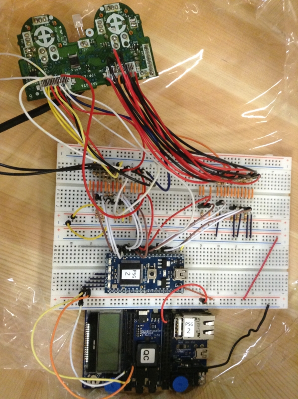

FLL
====

Frame Level Language for controlling DUALSHOCK2 from mbed

See: https://developer.mbed.org/users/amutake/code/fll/

Examples
--------

- https://developer.mbed.org/users/amutake/code/koibumi2000/
  - http://amutake.hatenablog.com/entry/2015/02/23/183802
